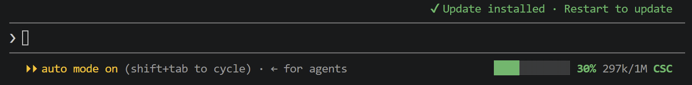

# claude-mods

Claude Code mods for personal use. Needs a recent Claude Code build (written on 2.1.287).



| Mod | What it does |
| --- | --- |
| `context-bar` | Colored context-window fill bar in the prompt footer: green, yellow from 60%, red from 80%. |
| `account-badge` | Signed-in org as a short abbreviation (`CSC`, `PERS` for personal accounts), red when signed out. |

### context-bar options

Set them in `/config` (each is a row under the plugin's name).

| Option | Values | Default |
| --- | --- | --- |
| Bar coloring | `usage`: one color by how full the window is. `sources`: a segment per context source in `/context`'s colors, the autocompact buffer at the right end; hover the bar for a legend (fullscreen mode). | `usage` |
| Bar glyphs | `blocks` █░, `bars` ▰▱, `squares` ■□, `line` ━─ | `blocks` |
| Bar width | 6 to 40 cells | 12 |
| Color-blind textures | `sources`: each source gets its own pattern (█ ▓ ▚ ▄ ▀ ...). `usage`: the pattern changes at 60% (▓) and 80% (▚). | off |

## Install

```
/plugin marketplace add Amnesiac9/claude-mods
/plugin install context-bar@amnesiac9
/plugin install account-badge@amnesiac9
```

Update later with `/plugin marketplace update amnesiac9`.

## Develop

Load the folders live instead of installing, in `~/.claude/settings.json` (`;` on Windows, `:` on Mac/Linux):

```json
{ "env": { "CLAUDE_CODE_PLUGIN_DIRS": "C:/dev/claude-mods/context-bar;C:/dev/claude-mods/account-badge" } }
```

Saves hot-reload. Check with `claude plugin validate <mod>` and `claude plugin test <mod>`.

## Contributing

Enable the repo's git hooks once per clone:

```
git config core.hooksPath .githooks
```

- `pre-commit` fails when a mod folder is missing from the Mods table above or from `.claude-plugin/marketplace.json` (or either lists one that's gone). Claude Code sessions in this repo get the same check as a Stop hook.
- `commit-msg` strips Claude co-author trailers. CI rejects any that get through.

New mod: add its folder, a row in the Mods table, and an entry in `marketplace.json`.

## License

[MIT](LICENSE)
